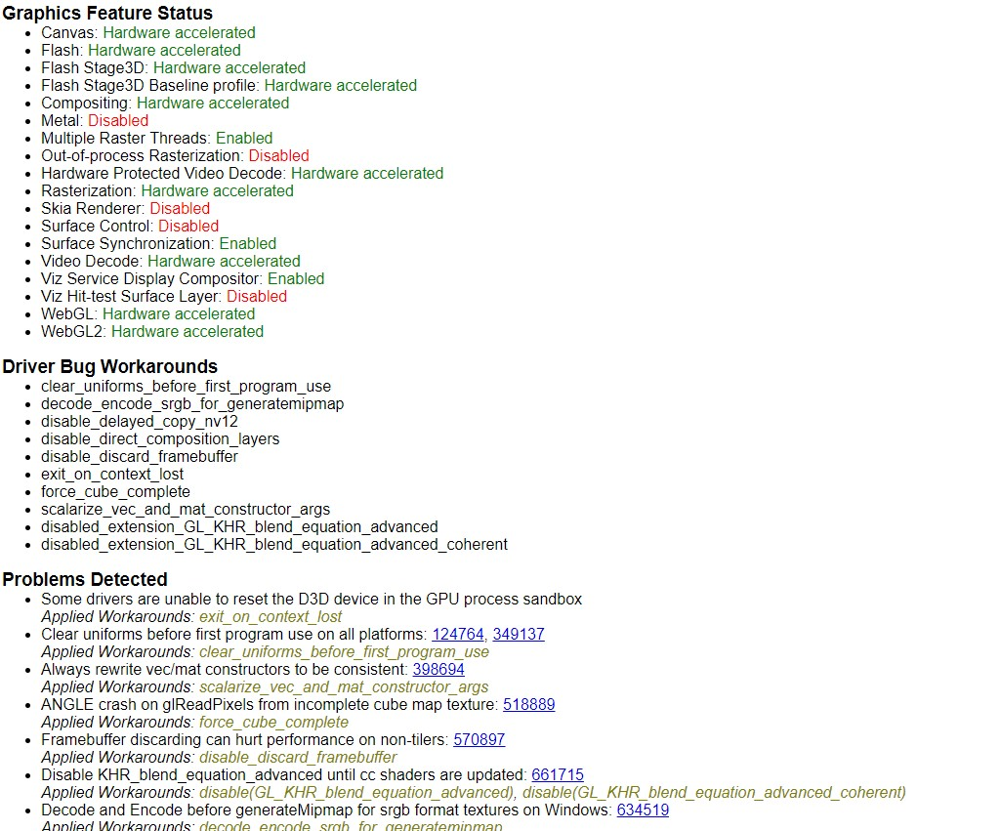
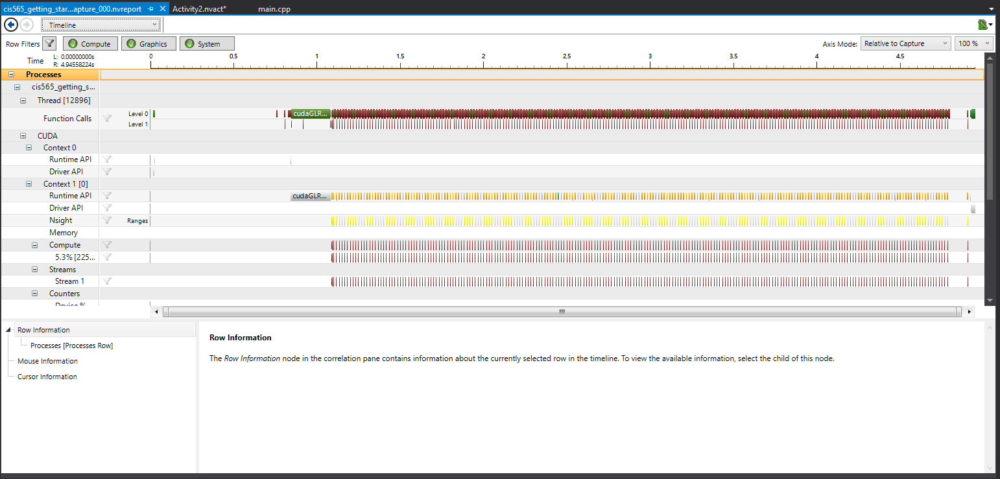
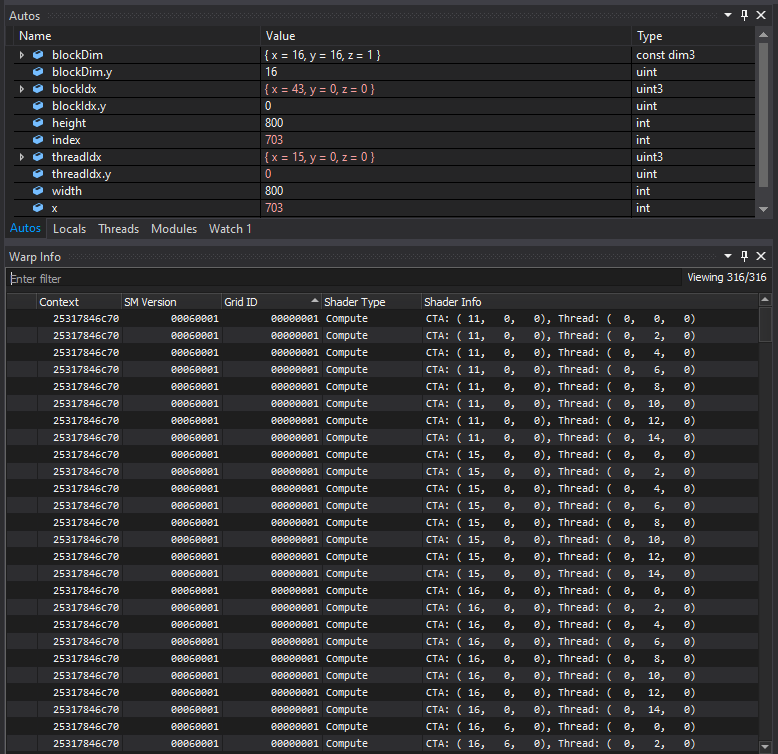

Project 0 Getting Started
====================

**University of Pennsylvania, CIS 565: GPU Programming and Architecture, Project 0**

* Taylor Nelms
  * [LinkedIn](https://www.linkedin.com/in/taylor-k-7b2110191/), [twitter](https://twitter.com/nelms_taylor)
* Tested on: (TODO) Windows 22, i7-2222 @ 2.22GHz 22GB, GTX 222 222MB (Moore 2222 Lab)
  * Note: eventual machine will not be one of the Moore lab machines; will instead be running with a GTX 1650 graphics card, with no DXR

### README

As an initial note: this project is slightly premature for me; I'm still acquiring parts to put together a working machine for this class, so I will need to do all these steps again sometime next week.
As for specs, it will be running a Intel Core i3-9100F Coffee Lake 4-Core 3.6 GHz processor, along with a Geforce GTX1650 graphics card, with 16GB of RAM.

By that same token, I was also not able to do any of the DXR elements of the assignment.

#### Part 2.2

The chrome set-up worked fine, as shown by this screenshot showing the ability to make use of WebGL:

#### Part 5

I'll admit that I'm not yet hyper-familar on how to read the following analysis:

#### Part 6

Similarly, I'm not sure exactly what I should be looking at within these debugging outputs, though once I get deeper into the weeds trying to implement things, they'll likely prove useful

#### Project Feedback

This project was interesting because while getting all the pieces and parts together early is tremendously valuable, the actual mechanisms were less useful without a solid analytical or productive goal behind them. I can go through the motions of setitng breakpoints and whatnot, but it would have been perhaps more interesting if I had needed to do so to solve a problem. Additionally, getting logistics for the class together on two days notice has been an interesting, but ultimately necessary, experience.
